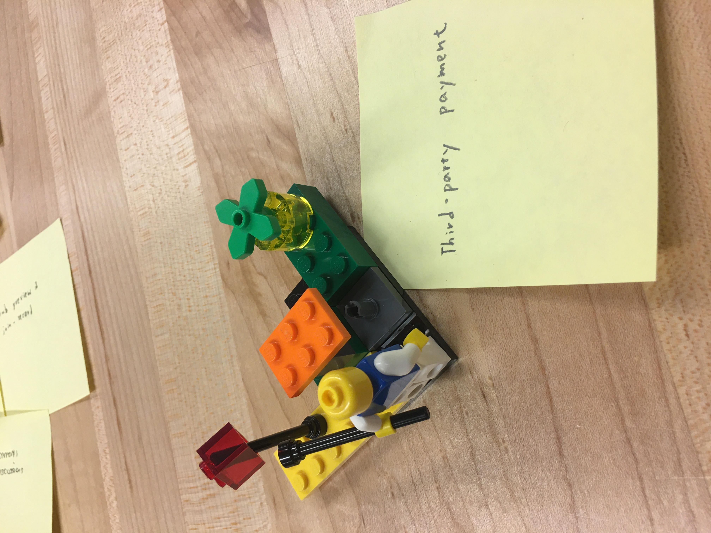
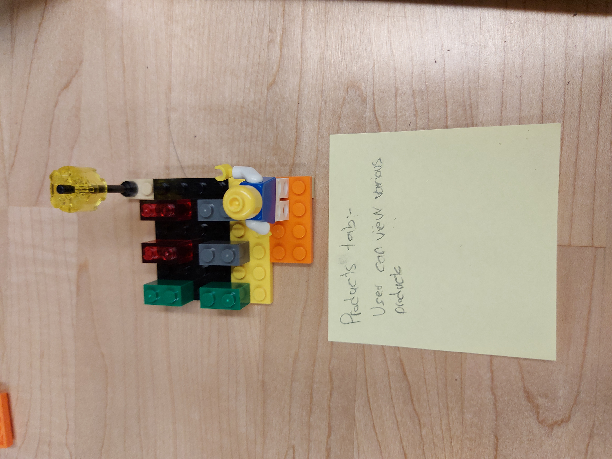
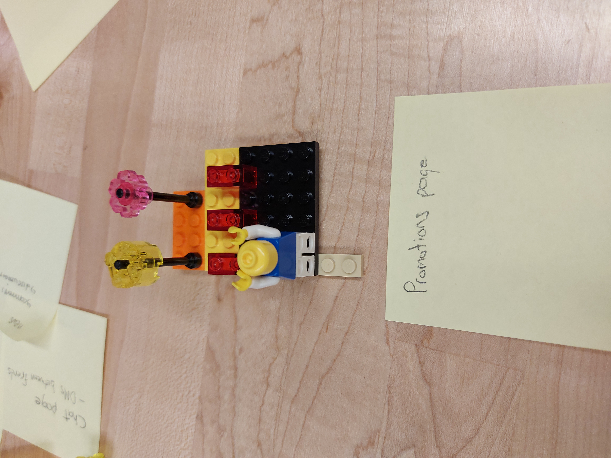
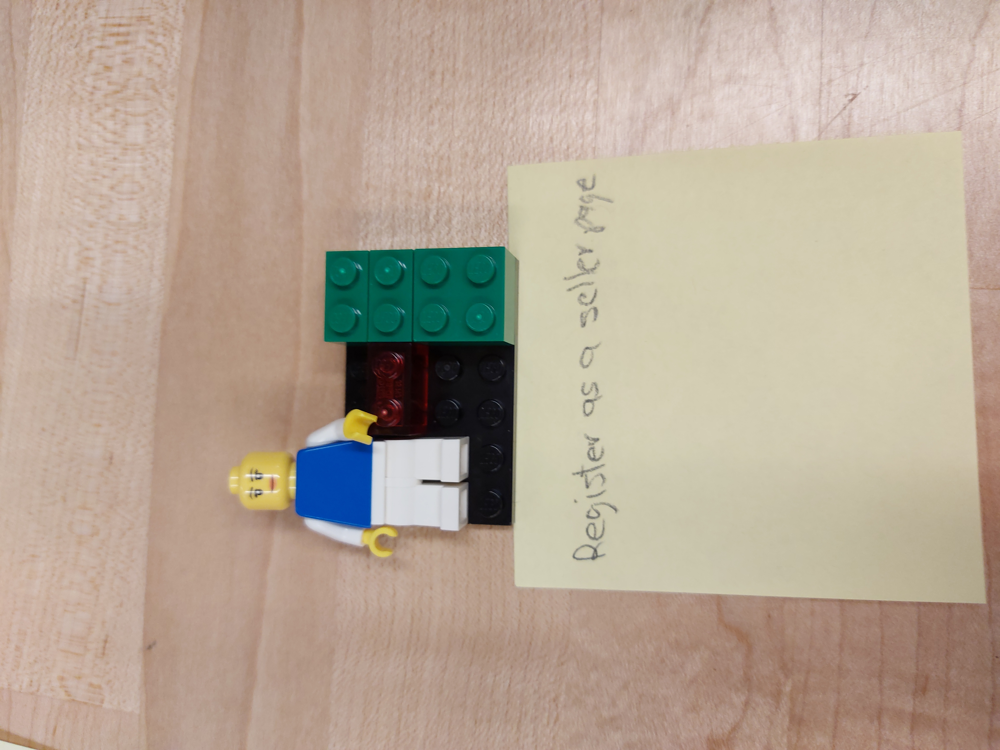
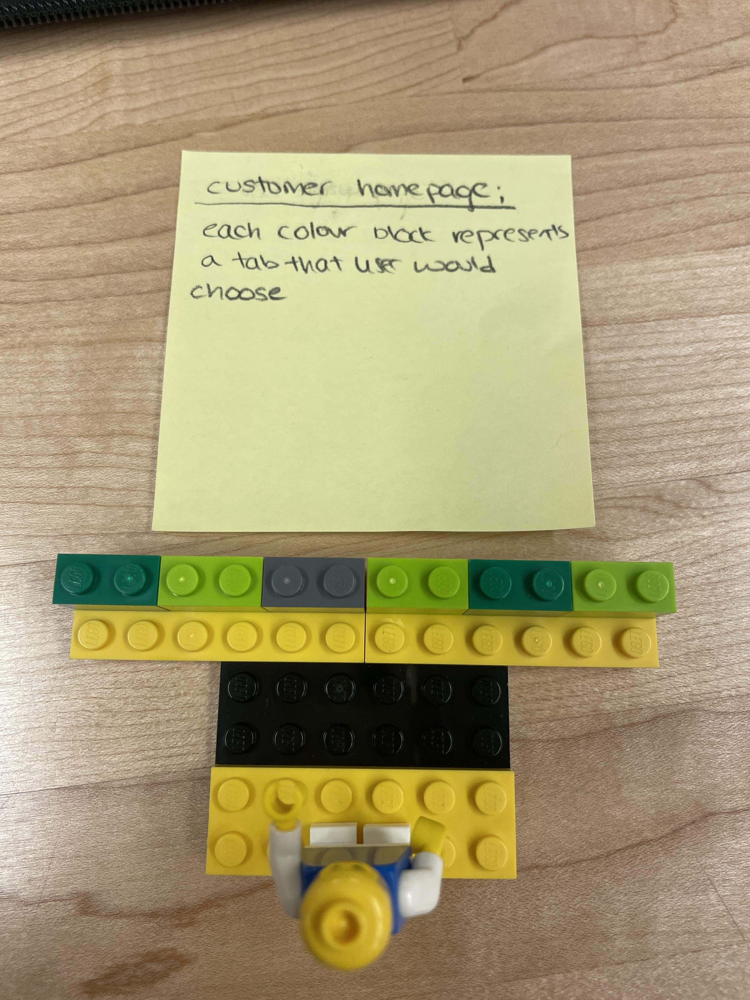

## Access Earning report

- features
  - user can track the spending and earning of the business relating to the accoutn
- Model explaination
  - the premium user with the crown is trying to see what makes up his business
  - the plant sits on the top of the soils symbolize the business
  - the figure is looking through each layer of the soil to see which layer is the most nutritious. This is an analogy of the earning report provided to the business owner provide great insight to user's business

## Third-party payment

- feature
  - user don't have to provide credit card information to our platform
  - user can use third-party payment like Paypal
- Model explanation
  - the figure use the extended torch as source of fire in order light up the candle in front of it
  - the lit-up torch symbolize the third-party payment platform where the user store the information
  - user lighting up the candle is an anology of user authorizing this platform to access his/her payment information.

## product advertisement

- feature
  - seller can purchase the advertisement on the platform
  - the advertisement will be presented to some users if they freqently search related terms
- model explanation
  - the figure is feeding a charcoal to the stove indicating that the advertisement comes with cost
  - the plant sits on the top of the stove symbolize the business which the figure in the picture is trying to keep it warm and growing

## Shopping cart

- Feature
  - Registered users can add products they want to purchase in the future to this list
  - The user can view this list whenever they want
- Model explanation
  - The figure is viewing the products that are in the shopping cart. The products are the lego pieces which are colorful to show that these are the products that caught the users attention

## Contact page

- feature
  - Users can find the contact details of the company to whom the website belongs to
- model explanation
  - The figure is standing by a phone ready to answer the users questions or complaints

## Previous orders page

- Feature
  - Registered users can view the products that they have purchased in the past and their status( delivered, processing, shipping etc)
- Model explanation
  - The figure is viewing the products that they have already purchased. The green blocks signify orders that has already been delivered and the red block represents the undelivered items.

## Products tab

- Feature
  - User can browse and search among the various products available on the site
- Model explanation
  - The figure is viewing the various products that is available on the site.

## Promotions page

- Feature
  - This page displays the current promotions available on the site
- Model explanation
  - The figure is happy to see the various promotions which is represented by bright coloured blocks to show that these products are the ones that would catch the attention of the user.

## Register as a seller page

- Feature
  - Prospective sellers will register to be able to sell on the site subject to approval from the company that the website is under.
- Model explanation
  - The figure is presenting itself to the company as a potential seller and they are waiting to receive what money that they could potentially receive after they become sellers on the site.

## Account Page

- feature
  - Users can see their first name, last name and email on the account page
  - Users can manage theri first name, last name, and email on the acount page
  - Users can see a list of orders they have purchased in the past and/or orders that are in progress
- model explanation
  - the figure is viewing the products that are in an account page. The products are the lego pieces which are colorful to show that these are the products that caught the users attention. The green block represent the first name text box. Tje grey blocj represents the last name text box. The blue box represents the email text box. The orange block represents the user order info

## Customer Homepage

- feature
  - Users can see many tabs that represent an option that the user can pick and choose such as the search tab, products tab, manage account tab
- model explanation
  - the figure is viewing the customer homepage as soon as they log in or sign in. Each colour blocj represents a tab that the user would choose.
